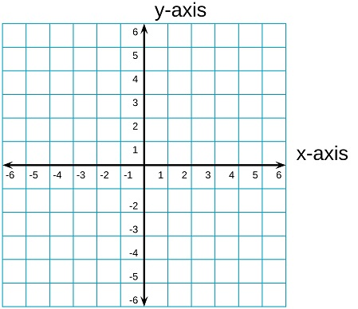

# What is Matplotlib:
> 1. ### Matplotlib Python ki aik Open-Source library hai jo hume `charts`, `graphs` aur `visualizations` banane mein madad deti hai. Isay `plotting library` bhi kehte hain.

> 2. ### Isay zyada tar Python ke data science eco-system mein NumPy aur Pandas ke saath mila kar istemaal kiya jata hai taake data ka analysis graph ki surat mein kiya ja sakay

# Matplotlib Installation Process:

> 1. ### `pip install matplotlib`

> 2. ### `import matplotlib.pyplot as plt`

# Basics for Matplotlib:

# What is Axis in Matplotlib:
> 1. ### Sub se pehle aap ko yeh pata hona chahiye ke Matplotlib mein har graph ke do main hissay (axis) hote hain:

> 2. ### Jab bhi hum graph banate hain, to hum ek plane (khali jagah) lete hain. Us plane mein do lines hoti hain.

# What is X or Y Axis:

> 1. ### Ek horizontal line jo (left to right) jaati hai isay - `X-axis` kehte hain.

> 2. ### X-axis par woh cheezein rakhi jaati hain jo independent hoti hain – yani jo khud badalti hain aur dosri cheezon par asar daalti hain.

> 3. ### Is par aam taur par time, sequence, categories (jaise months, age, number of items) aate hain.

--- 
> 1. ### Ek vertical line jo (up to down) jaati hai isay - `Y-axis` kehte hain.

> 2. ### Y-axis par woh cheezein rakhi jaati hain jo dependent hoti hain X Axis per – yani jo X-axis ke badalne se badalti hain.

> 3. ### Is par values, measurements, results , Scores or Temperatures aate hain.

# What is Origin:

> 1. ### Yeh dono lines ek dusre ko zero (0) par cut karti hain – is point ko `origin` kehte hain.



# What is Charts in Matplotlib:
> 1. ### [Charts in Matplotlib](charts_02.py)

# Examples:

> 1. ### `plt.plot(X, Y)`: Yeh computer ko batata hai ke graph taiyar karo.

> 2. ### `plt.show()`: Yeh graph ko screen par pop-up kar ke show karti hai.

```py
days = [1, 2, 3, 4] # X Axis
temperature = [30, 32, 28, 35] # Y Axis

plt.plot(days, temperature)
plt.show()
```

---

```py
import matplotlib.pyplot as plt

day = [1, 2, 3]
temp = [20, 30, 40]

plt.plot(day, temp) # Graph ko ready karta hai

plt.title("Weekly Weather Report" fontsize=14, fontweight='bold') # Pure graph ki heading
plt.xlabel("Days") # X-axis ka Label yeah Title
plt.ylabel("Temperature") # Y-axis ka Label yeah Title

plt.show()
```
---

# Coloring

```py
import matplotlib.pyplot as plt

month = [1, 2, 3, 4, 5, 6]
sales = [5000, 7000, 6000, 9000, 11000, 8000]

# Line Colors
plt.plot(month, sales, color='red')
plt.plot(month, sales, color='blue')
plt.plot(month, sales, color='green')
plt.plot(month, sales, color='orange')
plt.plot(month, sales, color='purple')
plt.plot(month, sales, color='pink')
plt.plot(month, sales, color='brown')
plt.plot(month, sales, color='black')
plt.plot(month, sales, color='gray')

# Short color codes (ek letter)
plt.plot(month, sales, color='r')
plt.plot(month, sales, color='g')
plt.plot(month, sales, color='b')
plt.plot(month, sales, color='c')
plt.plot(month, sales, color='m')
plt.plot(month, sales, color='y')
plt.plot(month, sales, color='k')
plt.plot(month, sales, color='w')

# RGB values (0 se 1 ke darmiyan)
plt.plot(month, sales, color=(0.8, 0.2, 0.5)) # custom color

# Combine All of them
plt.plot(month, sales, color='green')

# Labels and Title (sales ke hisaab se)
plt.xlabel('Months')
plt.ylabel('Sales')
plt.title('Monthly Sales Record')

# Show
plt.show()
```

---

# Lining and Thickness

```py
import matplotlib.pyplot as plt

month = [1, 2, 3, 4, 5, 6]
sales = [5000, 7000, 6000, 9000, 11000, 8000]

# Basic linestyles
plt.plot(month, sales, linestyle='-')
plt.plot(month, sales, linestyle='--')
plt.plot(month, sales, linestyle=':')
plt.plot(month, sales, linestyle='-.')

# Advanced linestyles
plt.plot(month, sales, linestyle=(0, (1, 10)))
plt.plot(month, sales, linestyle=(0, (5, 1)))
plt.plot(month, sales, linestyle=(0, (3, 5, 1, 5)))

# Line thickness
plt.plot(month, sales, linewidth=8)

# Combine all of them
plt.plot(month, sales, color='green', linestyle=(0, (5, 3)), linewidth=3)

# Labels and Title
plt.xlabel('Month')
plt.ylabel('Sales')
plt.title('Monthly Sales Record')

# Show
plt.show()
```

# Marker Shapes

```py
import matplotlib.pyplot as plt

month = [1, 2, 3, 4, 5, 6]
sales = [5000, 7000, 6000, 9000, 11000, 8000]

# Marker Shapes
plt.plot(month, sales, marker='*')
plt.plot(month, sales, marker='o')
plt.plot(month, sales, marker='s')
plt.plot(month, sales, marker='D')

# Marker Thickness
plt.plot(month, sales, markersize=10)
plt.plot(month, sales, ms=15)

# Marker Face Color (markerfacecolor)
plt.plot(month, sales, marker='o', markerfacecolor='black')
plt.plot(month, sales, marker='o', mfc='cyan') # short form

# Marker Edge Color (markeredgecolor)
plt.plot(month, sales, marker='o', markeredgecolor='red')
plt.plot(month, sales, marker='o', mec='yellow') # short form

# Marker Edge Width (markeredgewidth)
plt.plot(month, sales, marker='o', markeredgewidth=2)
plt.plot(month, sales, marker='o', mew=4) # short form

# Combine all of them
plt.plot(month, sales, marker='*', markersize=5, markeredgecolor='red', markerfacecolor="green", markeredgewidth=2)

# Labels and Title
plt.xlabel('Month')
plt.ylabel('Sales')
plt.title('Monthly Sales Record')

# Show
plt.show()
```
