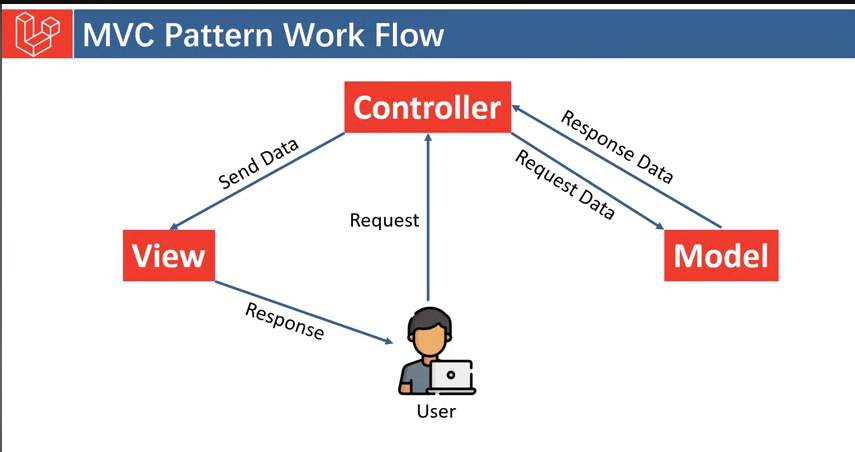
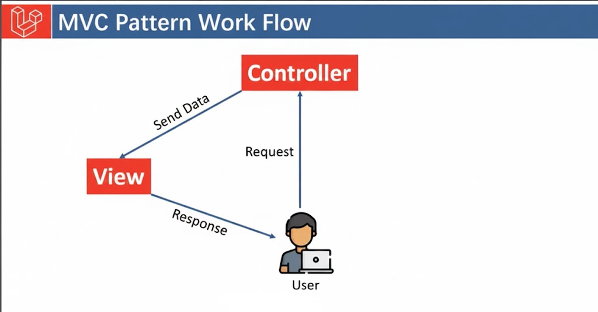

# What is MVC?
1. **MVC** = `Model` + `View` + `Controller`
2. Ye ek software design pattern hai 
3. **Purpose:** Code organize aur maintainable banta hai
4. Laravel MVC architecture pe kaam karta hai.

# What is Model?
[Model](./MVC/Model.md)

# What is View?
[View](./MVC/View.md)

# What is Controller?
[Controller](./MVC/Controller.md)

# `MVC` Workflow:

# `VC` Workflow without `Model`:
