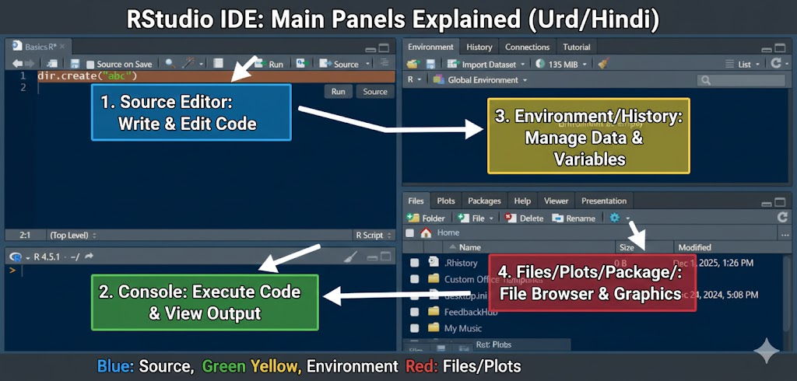

# What is R Programming?
1. R ek programming language hai — jaise Python, C, ya Java hoti hain.
2. lekin iska main focus “data” aur “statistics” par hota hai.
3. Iska use hum data ko samajhne (analyze karne), calculations karne (statistics) aur graphs banane (visualize karne) ke liye karte hain means.
4. Data kia hota hai jaise Numbers , Words , Values , Categories yeah sub Data hai. 
5. Data ko drawing (picture) ke form me dikhana isa hum Graphs bolte hai.

# What is Statistic:
1. Data ke numbers ko study karna aur unse meaning nikalna iska (Statistic) bolte hai.
   
## `Èxample 01`
- Marks: 80, 90, 70, 100
1. Average (mean) nikal sakte hain → sabka total ÷ count
2. Maximum marks → sabse zyada
3. Minimum marks → sabse kam <br>
`Ye sab kaam Statistics ke under aata hai.`

# What is Analysis:
1. Data ko samajhna aur usse nateeja (result) nikalna.

## `Example 01`
1. Kis student ke marks sabse zyada hain?
2. Kis subject me students kamzor hain? <br>
`Ye sab data analysis ke kaam hain.`

# R Programming ke 2 parts hote hain:
1. R Language
2. R Software (RStudio)

## Download R Langauge:
1. https://cran.r-project.org/bin/windows/base/

## Download R Studio (IDE)
2. https://posit.co/download/rstudio-desktop/

## What is IDE (Integrated Development Environment):

1. Coding karne ka aik mukammal setup jahan editor + compiler + debugger sab sath mil kar kaam karte hain.

## Example 01:
1. VS Code
2. PyCharm
3. IntelliJ IDEA
4. Android Studio
5. Visual Studio

# How to Create File , Folder


## 📝 Source Editor (Top-Left Panel)
1. Yeh woh hissa hai jahan aap apna R code likhte, edit karte, aur save karte hain.

## 📊 Console (Bottom-Left Panel)
1. Yeh woh hissa hai jahan aapka code execute hota hai aur results dikhte hain.

## 🌳 Environment/History/Tutorial (Top-Right Panel)
1. Yeh panel variables aur data ko manage karta hai jo aapki current R session mein hain.

## 📁 Files/Plots/Packages/Help (Bottom-Right Panel)
1. Yeh panel files, graphical output, aur help documentation ke liye hai.

# Shortcut Keys
1. Ctrl + Shift + N -> isa new Script open hoge
2. ```r 
    dir.create("abc") # new folder create karne ka liya
```
