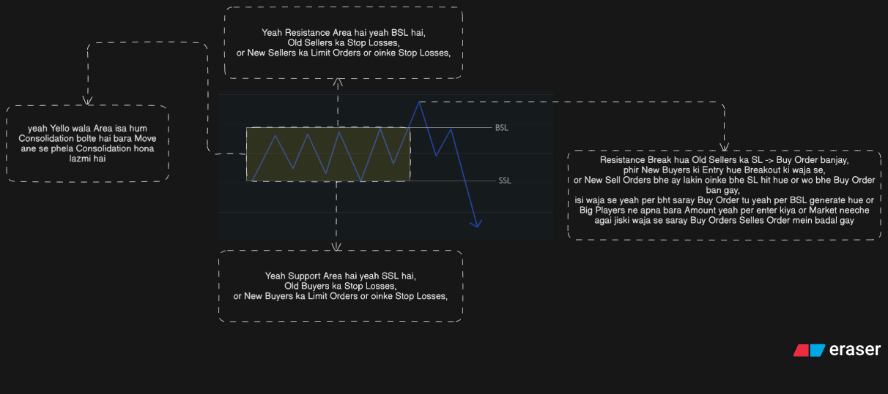

## How Order Fill?
1. Aap tab tak kuch kharid (Buy) nahi sakte jab tak koi dusra usse bechne (Sell) ko tayyar na ho.
2. Agar aap `1 Lot Buy` karna chahte hain, toh market mein koi aisa banda hona chahiye jo `1 Lot Sell` kar raha ho.
3. Jab aapka `Buy order` aur kisi ka `Sell order` aapas mein match hota hai, toh usse hum kehte hain ke `order Fill` ho gaya.

## 2 Types of Order:

## Market Order:
1. Ye wo order hai jo aap "Abhi ke Abhi" means Market ka Current Price per Buy yeah Sell karna chahte hain.

## Limit Order:
1. Ismein aap market ko kehte hain: "Bhai, jab price kisi Specific level par ayge tu he mein Buy yeah Sell karonga.

## 1. Liquidity kya hoti hai? (Simple Definition)

1. Market mein `buy` & `sell` orders ka available hona jinke zariye price Move karta hai.
2. Ager Market mein Orders he na ho it's means ka Market mein Liquidity he nahe hai tu is waja se Price bhe Move nhe karayga.
3. Liquidity = `Paisa` & `Orders`
4. Jahan zyada orders honge, wahan liquidity zyada hogi.
5. Jahan orders kam honge, wahan liquidity kam hogi.

## Purpose:
1. Market hamesha aik liquidity se doosri liquidity ki taraf move karti hai. Iska sirf 2 muqsad hain:
2. **Orders Fill Karna:** Bare players ko apni bari trades lagane ke liye Fuel chahiye hota hai, aur wo fuel `Stop Losses` hain.

## 2. Liquidity kin Areas mein subse zeyada hoti hai:
1. Liquidity Current price means `Market orders` mein nahe hoti ois time tu Market us liquidity ko `khane` ke liye aate hain. Liquidity hamesha `Limit Orders` wale areas mein hoti hai Limit Order mein bhe 2 Most Important Areas hai.

1. [Major High (Strong Resistance) or Major Low (Strong Support)](../support_resistance.md)

2. [Equal Highs & Equal Lows](Highs_and_Lows.md)

3. [PDH (Previous Day High) & PDL (Previous Day Low)](PDH_PDL.md)

4. [Swing High & Swing Low](SH_SL.md)

5. [Internal Liquidity (IRL)](IRL.md)

## Buy Side Liquidity (BSL) - **Upar Wala Area**

1. High ke upar jo stop losses hote hai wo buyers ka hotay hain, unko **Buy Side Liquidity** kehte hain.
2. Jo log sell karte hain, unka stop loss **high ke upar** hota hai
3. Jab price upar jaa kar high todta hai:
4. Sellers ka SL hit hota hai
5. Wo SL **buy order ban jata hai**
6. is waja se Market ko liquidity mil jati hai
7. **BSL** ka matlab hai: **Sellers ki Qabristan.** (Jahan unke Stop Loss hit hote hain aur wo majbooran Buy karte hain).

## Example se samajte hai **BSL** ko.

* Hum ne resistance par **Sell** kiya. Hum ne socha "Price yahan se niche giregi."
* Hum ne apna **Stop Loss (SL)** upar rakha.

* **Logical Point:** Jab Sell ka Stop Loss hit hota hai, toh wo darasal ek **Buy Order** ban jata hai.
* **Bank ka Faida:** Bank ko mehnga **Bechna (Sell)** tha. Wo price ko upar le jate hain. Humara SL hit hota hai, hum majbooran "Buy" karte hain. Bank apna mal humein **Bech (Sell)** deta hai.
* **Simple:** BSL wo jagah hai jahan chote traders ke **Buy Orders** ka dher laga hota hai aur Bank wahan se **Sell** karta hai.

## 2. Sell Side Liquidity (SSL) -  **Niche Wala Area**

1. Low ke neeche jo stop losses aur sell orders hotay hain, unko **Sell Side Liquidity** kehte hain.
2. Jo log buy karte hain, unka stop loss **low ke neeche** hota hai
3. Jab price neeche jaa kar low todta hai:
4. Buyers SL hit hota hai
5. Wo SL **sell order ban jata hai**
6. Market ko liquidity mil jati hai
7. **SSL** ka matlab hai: **Buyers ki Qabristan.** (Jahan unke Stop Loss hit hote hain aur wo majbooran Sell karte hain).

## Example se samajte hai **(SSL)** ko.

* Hum ne support par **Buy** kiya. Hum ne socha Price yahan se upar jayegi.
* Hum ne apna **Stop Loss (SL)** Support ka niche rakha.

* **Logical Point:** Jab humara Buy wala Stop Loss hit hota yeah hum panic mein akar apne position ko cut kar reha hote hai tu ois situation mein hum, market mein kya kar rahe hote hain? 
ois situation mein jab hum humera stop loss hit ho reha hota hai yeah panic mein akar hum apne position ko close kar reha hote hai tu indirectly humera wo paisa jo humne loss kardiya wo paisa Sell order mein badal jata hai or jab Support Break hota hai tu Support ka neecha tu waise he new sell orders hote tu waha per wo sell orders bhe Fill ho jaate hai is waja se achanak se Sell Orders ka tofan ajata hai yahi wo moment hota hai jahan market mein sabse zyada liquidity hoti hai. tu is moment per Big Player kia karte hai? Jab Banks saare Retailers ke "Sell Orders" kharid lete hain, toh ab market mein bechne wala koi bacha hi nahi tu is waja se market mein (Supply khatam) hoti hai. isi waja se waha Big Player saray Retail Traders ka Sell orders buy kar layte hai. 

* **Bank ka Faida:** Bank ko sasta **Kharidna (Buy)** tha. Wo price ko niche gira kar humara SL hit karwate hain. Jaise hi humara SL hit hota hai, hum majbooran "Sell" karte hain. Bank us waqt wahan khara hota hai aur hamara sara "Sell" kiya hua mal **Kharid (Buy)** leta hai.
* **Simple:** SSL wo jagah hai jahan chote traders ke **Sell Orders** ka dher laga hota hai aur Bank wahan se **Buy** karta hai.

## Key Point About SSL:
1. Downtrend mein market ka Main Target hamesha `SSL (Sell Side Liquidity)` hota hai
2. Market purane lows ko break kar ke niche jana chahti hai.
3. Lekin, wahan tak pohanchnay ke liye market ko pehle `BSL` hunt karni parti hai oiska bad he market neecha jaati hai.
---

# What is Liquidity Sweep?
1. Liquidity Sweep tab hota hai jab market kisi purane (BSL) ya (SSL) ko thora sa cross karti hai, lekin wahan rukti nahi hai balke. Market waha se foran wapis palat jati hai aur sirf aik "wick" chorti hai oisa hum Liquidity Sweep bolte hai.

2. wo Levels jo Important hai oiska uper or neecha Liquidity hoti hai right ab Liquidity Sweep kaha hue hai or kaise hote hai oisko kaise Identify kare Liquidity Sweep wali Candle ki body chay ho Level High per jo yeah Low per oiski Body kabe bhe ois Level ka Uper yeah neecha Close nahe hoti hai wo ois Level ko uper yeah neecha tu jayge lakin Liquidity hunt karke wapis Apposite Direction mein ati jiski waha se aik bari se Wick ban jaati hai isko hum Liquidity Sweep bolte hai.

# What is Liquidity Grab?
1. Liquidity Grab thora "aggressive" hota hai means. Is mein market kisi level ko break karti chahay wo High ho yeah Low lakin price waha thori dair ka liya sustain karti hai taake logon ko lage ke `Breakout` yeah `Breakdown` ho gaya hai. Jab retail traders breakout samajh kar entry lete hain, tu Smart Money unke orders ko "grab" karti hai aur market ko opposite direction mein le jati hai isme Candle Level ka Uper yeah neecha Close ho sekhti hai isme farq nahe parta hai.

# My Experience:
1. humesha aik baat yaad rehko market mein aik bara move kab ata hai jab yeah 2 kam ho jaate hai phela baray move se phela market consolidate karege jab market mein consolidation hoti hai tu multiple Support or Resistance Create hote hai or oinke uper or neeche liquidity ka samandar hota hai jisa hum Stop Losses , BSL , SSL , Limit Orders bolte hai.

2. jab Market Consolidation kar layte hai or bht sari Liquidity Generate ho jaati hai tu Market mein aik Breakout yeah phir Breakdown ata yeah Depend karta hai Market ka ka Current Trend per jab market Breakout yeah Breakdown karti hai tu ois situation mein market mein Liquidity Hunt hoti hai or jab Liquidity Hunt hoti hai tu Big Player apne bari Entry Enter karte hai ois time market mein aik bara move ata hai

