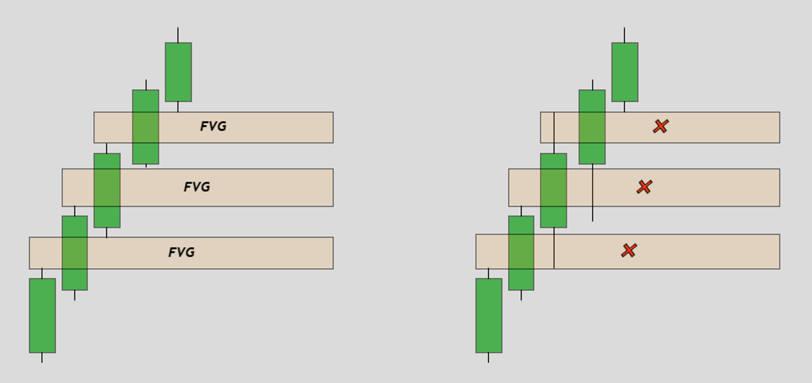
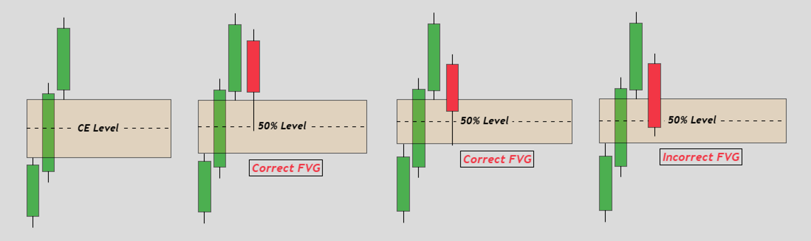

# What is Fair Value Gap?

1. FVG market mein price ki movement ke dauran banne wale gaps ko describe karta hai.
2. Yeah gaps market mein imbalance ya inefficiency ko dikhata hai means yeah wo levels hai jahan se price Impulsive Move dyta hai jiski waja se Market mein kch levels skip hojate hai or jiski waja se Gap Create hota hai. Or ois Gap ko FVG bolte hai.

3. Jab Big Players apne bade orders ko execute karte hain, toh market mein imbalance create hota hai, jisse FVG banta hai. Or Market in Gaps ko Fill karne zaror ati hai kue ka.

4. 3 Candles ki Formation se aik FVG create hota hai chahay wo Bullish ho yeah Bearish.	FVG ka gap kitna bara hai yeah chota isa koi fark nahe pharta hai bs FVG Valid hona chaiya.

## Bullish FVG:

## Bearish FVG:

# What is Consequent Encroachment (CE):

FVG se jo Gap create hota hai ois Gap ka 50% Area ko hum Consequent Encroachment bolte hai.	CE us gap ka 50% point hota hai jaha se Market aksar reverse ya continue ho sekhta hai.

